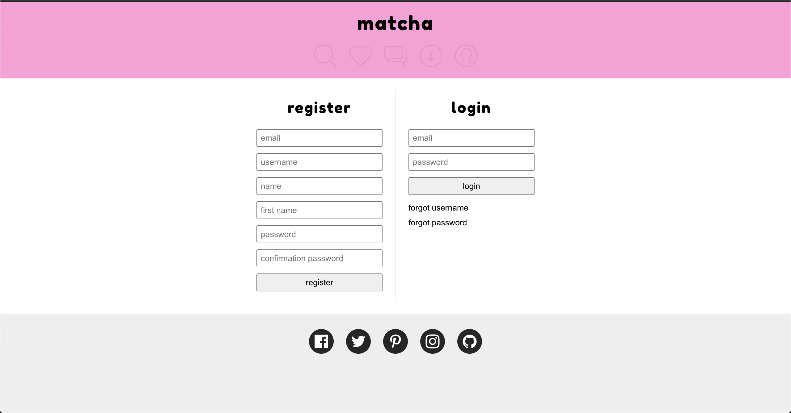
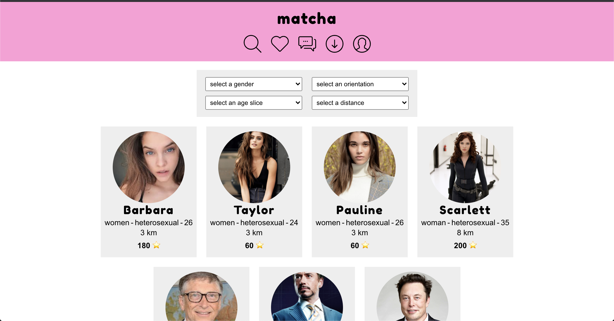
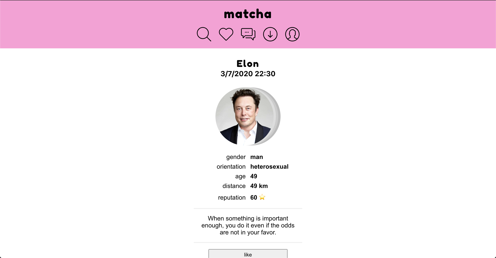

<strong>Matcha</strong>
 

<strong>*******IN PRODUCTION, NOT FINISH *******<strong>
 

Matcha is the dating website of the school 42.  
  We did it with react for the front and nodejs with express for the back 
  The whole project have to be secure again SQL injection and XSS injections. 
  It should have the following system:  
  - Like a user 
  - Message a user 
  - See the profile of a user 
  - Edit the profile 
  - Block a user 
  - Report a user 
  - Notification for specific action  
  To launch this app you will need to use docker with docker-compose.  
  If everything is installed, you can just do a "sh start.sh" or follow the setup guide

## SETUP
- `$> docker-compose -f docker-compose.build.yaml up`
- `$> docker-compose -f docker-compose.seed.yaml up --abort-on-container-exit`

## LAUNCH
- `$> docker-compose up`
